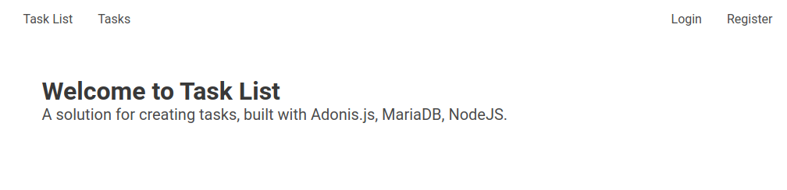
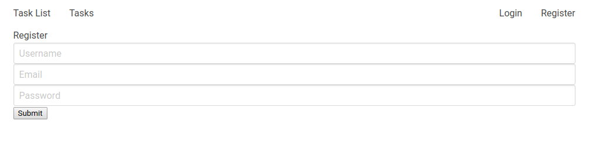
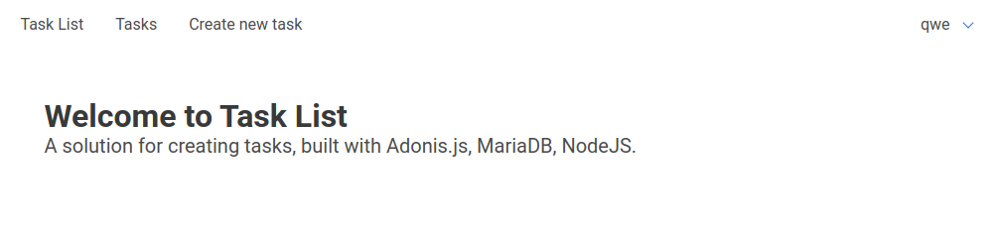
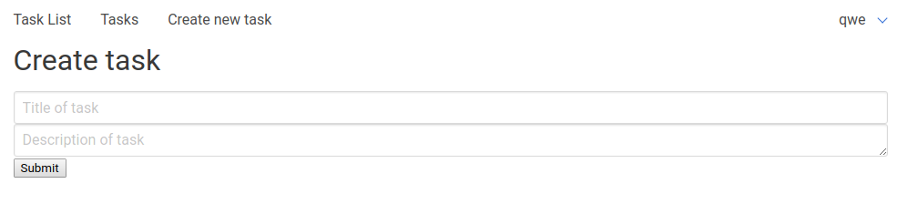
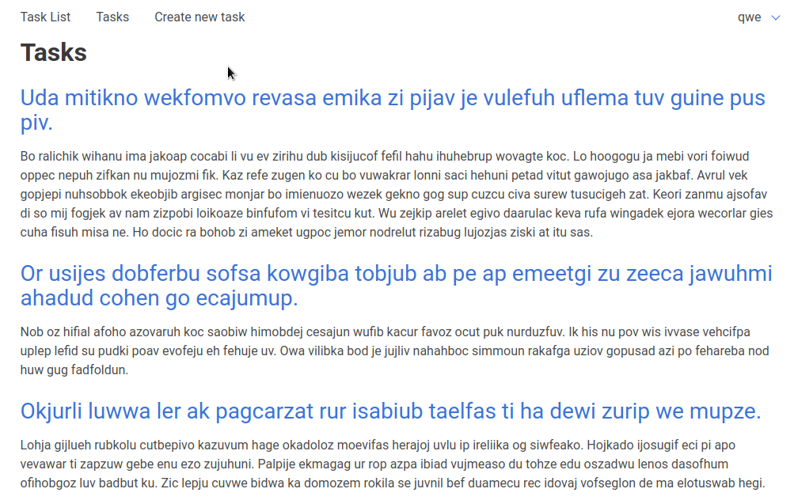

# TaskList

### Creating TaskList with user authentication: Adonis, MySQL (MariaDB), Node.js. Based on [jscrambler](https://blog.jscrambler.com/build-a-task-list-with-authentication-using-sql-node-js-and-adonis-part-1)

**Instalation:**

```
$ npm i -g adonis-cli
$ adonis new adonis-task-list
$ cd adonis-task-list
$ npm i
$ npm run serve:dev
```

MariaDB setup for my distro: [solus-setup](https://www.stuartellis.name/articles/solus-setup/#installing-mariadb)

install:

```
$ sudo eopkg install mariadb-server
$ sudo systemctl enable mariadb
$ sudo systemctl start mariadb
```

## Running MariaDB (mysql db setup reqired):

```
$ mysql -u root -q
```

update password:

```
UPDATE mysql.user SET password = PASSWORD('yourpassword') WHERE user
LIKE ‘root’;
FLUSH PRIVILEGES;
EXIT;
```

run and create collection:

```
$ mysql -u root -p
> create database COLLECTION-NAME;
```

update .env:

```
HOST=localhost
PORT=3333
APP_KEY=app_key
NODE_ENV=development
CACHE_VIEWS=false
SESSION_DRIVER=cookie
DB_CONNECTION=mysql
DB_HOST=127.0.0.1
DB_PORT=3306
DB_USER=root
DB_PASSWORD=XXXXXXX
DB_DATABASE=COLLECTION-NAME
```

# What it does
This system alows users to login and add new tasks to one big tasks list. I understand that there is noneed for this kind of system but it was just a training exercise. System not gonna be expanded in any way. 

## Welcome page


## Register page


## After login page


## Create task page


## Task list


# Conclusion

* Adonisjs is very slow - I don't know why but loadding another pages sometimes requires to refresh browser (and it doesn't depened on starting mode);
* System does not provide any feedback in console and terminal when in dev mode which makes it hard to debug;
* View layer is boring and not fun to code, like in almost any new js framework. I suppose next step for me will be to connect it to ReactJS with GraphQL. 